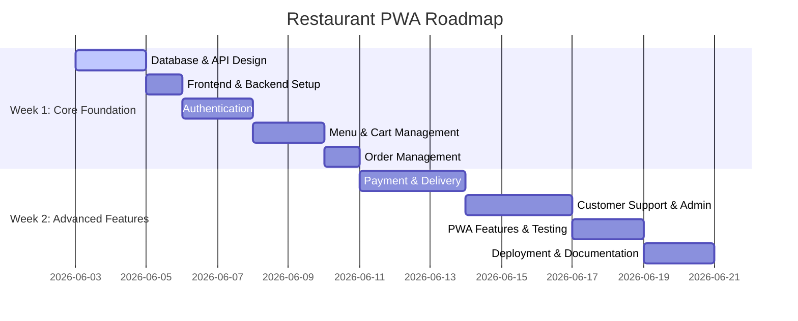

# Restaurant PWA Project Plan

This document outlines the development schedule, phase objectives, and team resource allocation for building the Restaurant PWA.

---

## 1. Project Timeline

---

## 2. Weekly Deliverables

### Week 1: Core Architecture & Crucial Workflows
Focuses on scaffolding the systems, setting up databases/servers, authentication, and core ordering flows.

- [x] **Database Design**
  - Schema creation, indexing, relationships, and migrations setup.
- [x] **API Design**
  - Definition of REST endpoints, schemas, payloads, and API contracts.
- [x] **Frontend Setup**
  - Framework initialization (Vite + React), styling system configuration, router, and basic layout structure.
- [x] **Backend Setup**
  - Server initialization, configuration, database connectivity, and base routing.
- [x] **Authentication**
  - User registration, login, hashing, JWT token-based session management, and role validation.
- [x] **Menu Management**
  - Fetching items by category, detailed item views, and stock availability updates.
- [x] **Cart Management**
  - State management for carts, adding/editing/removing items, and persistency checks.
- [x] **Order Management**
  - Checkout flows, order object construction, and order status tracking.

---

### Week 2: Integration, Support, and Launch
Focuses on payment processing, delivery integration, administrator dashboards, offline PWA features, and deployment.

- [x] **Payment Module**
  - Payment gateway integration, transaction records, and payment status hooks.
- [x] **Delivery Module**
  - Delivery dispatch, rider assignment, and real-time status tracking updates.
- [x] **Customer Support Module**
  - Complaint logging, support tickets creation, and response updates.
- [x] **Admin Dashboard**
  - Metrics, order management, menu editor, and complaints handling panel.
- [x] **PWA Features**
  - Service worker configuration, caching strategy (offline capability), manifest file, and install prompt.
- [x] **Testing**
  - Unit tests, integration tests, and end-to-end user path walkthroughs.
- [x] **Deployment**
  - Host setups (e.g. Vercel for frontend, Render/AWS for backend/database).
- [x] **Documentation**
  - API reference completion, system design graphs, and setup guide.

---

### Advanced Features (Completed Post-Launch)
Focuses on extending the user experience, maximizing customer retention, and facilitating customer relationship management.

- [x] **Loyalty Rewards Program**
  - Manager rules editor (setting earn/redeem conversion rates, minimum redeeming points threshold).
  - Customer profile widgets showing point balances and detailed transaction logs.
  - Automatic earning of points upon order delivery; deduction of points upon redemption at checkout.
- [x] **Promotions & Offers Module**
  - Support for percentage-based category discounts, flat checkout discounts with min-spend rules, and combo packages.
  - Interactive manager panel for creating, updating, toggling active states, and deleting offers.
  - Checkout calculator integration to auto-apply the best discount rate.
- [x] **Real-Time Notification System**
  - Supabase database triggers coupled with Node.js Express server to detect postgres insertions.
  - Persistent Server-Sent Events (SSE) server stream with query-token authentication.
  - PWA customer toast prompts, active admin alert popups, and unread notification bell badges.

---

## 3. Team Allocation & Responsibilities

| Role / Owner | Domain | Assigned Responsibilities |
| :--- | :--- | :--- |
| **Member 1** | Frontend + PWA | - React layout and component structure - Frontend state management (Cart, Authentication) - PWA integration (Service workers, offline caching) - UI/UX styling |
| **Member 2** | Backend + Database | - Database design and query optimization - Core API endpoints and routing - Authentication and role-based security layers - Admin dashboard metrics and data APIs |
| **Member 3** | Integration & Support | - Payment gateway integration - Delivery tracking module and rider assignment APIs - Customer support ticket workflows and complaint APIs |
