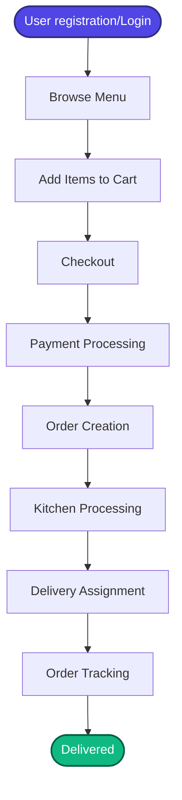
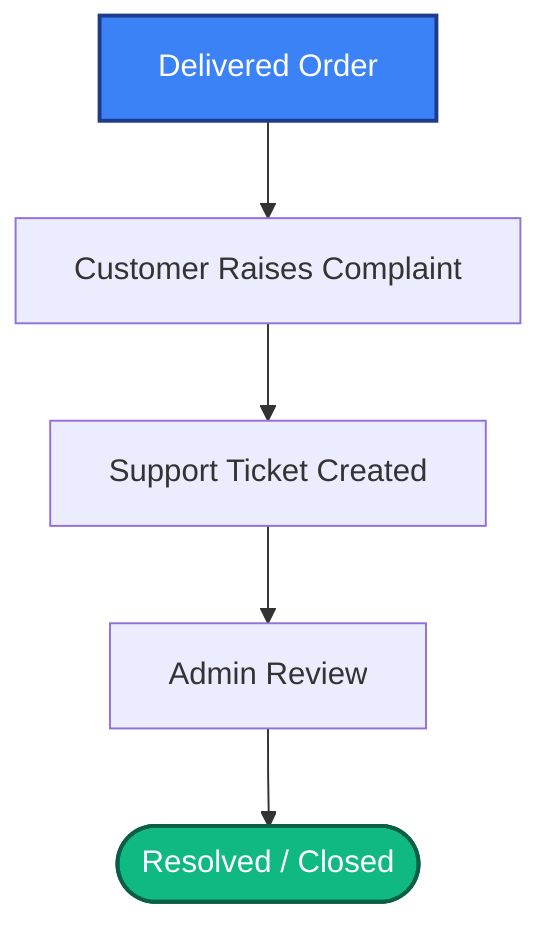
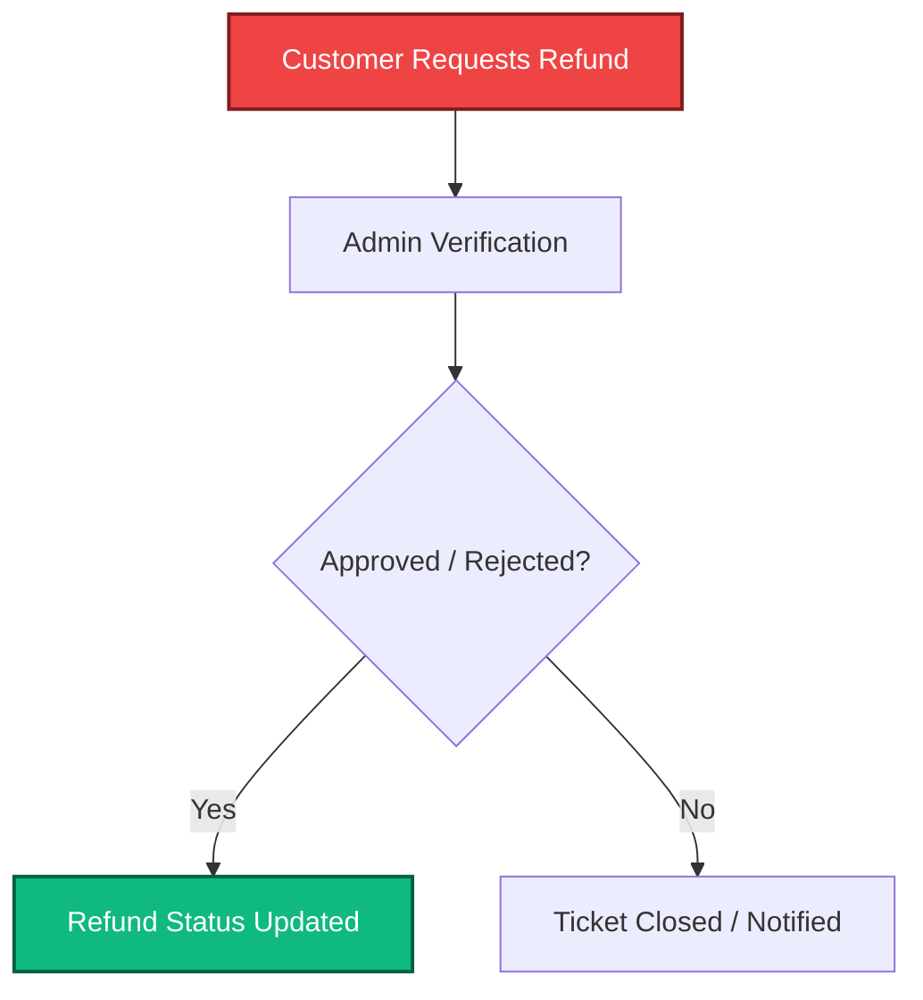
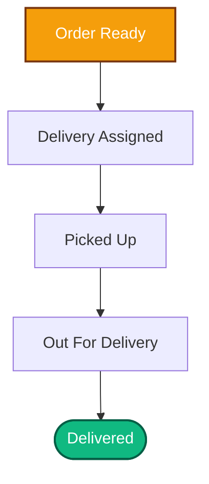
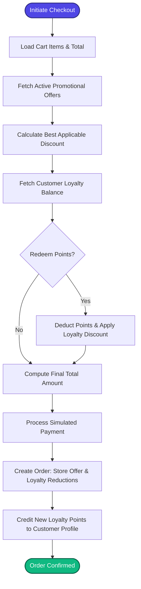
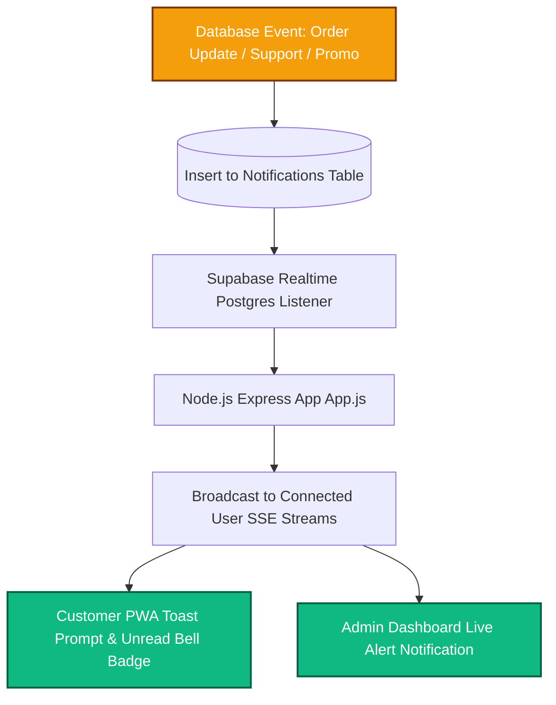
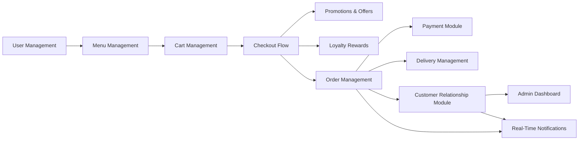

# System Workflow Documentation

This document describes the key operational flows and module interactions within the Restaurant PWA system.

---

## 1. Customer Ordering Flow

This flow covers the user journey from landing on the platform to order delivery.

---

## 2. Complaint Flow

This flow details how customer issues are logged, reviewed, and resolved.

---

## 3. Refund Flow

This flow tracks the financial resolution steps after a refund request is filed.

---

## 4. Delivery Flow

This flow manages the logistics steps once the food preparation is complete.

---

## 5. Offers & Loyalty Checkout Flow

This flow details how promotions and loyalty rewards are processed during checkout.

---

## 6. Real-Time Notification Broadcast Flow

This flow illustrates how live alerts propagate from database events to the client web applications.

---

## 7. Module Interaction

The high-level block interaction representing the system architecture dependencies.

